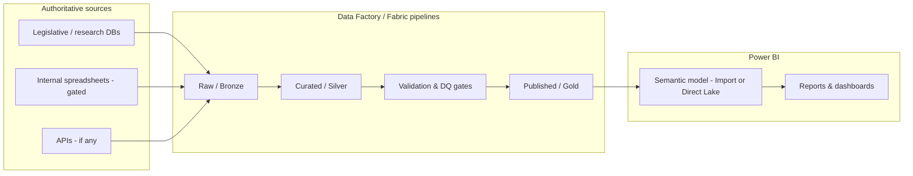

# HAP analytics delivery — Power BI + Data Factory (Strategic Analytics)

**Audience:** IT, Strategic Analytics, dashboard maintainers.  
**Directive:** Power BI is the certified delivery path for organizational visualizers; data is updated automatically through the data factory layer.  
**Principle:** No metric appears in production visuals unless it passed through a **validated, versioned pipeline**. Nothing that resembles “generated” or unverified text is stored or shown as data.

---

## 1. What this replaces (conceptually)

| Today (advocacy site) | Target (org standard) |
|----------------------|-------------------------|
| `state-data.js`, JSON files, manual edits | **Curated tables** in the lake/warehouse, loaded by **Data Factory** |
| Static HTML/D3 map | **Power BI** reports (and optional **certified** embed where approved) |
| Single-file truth | **One system of record** → pipeline → **gold** tables → Power BI semantic model |

The public `340b.html` stack can remain for external advocacy **only if** IT defines whether it is fed by **exported snapshots** from the same gold tables (build job) or is retired in favor of embed. That is a **governance** decision, not a technical default.

---

## 2. Reference architecture (Microsoft)

Use either **Fabric-first** (recommended for greenfield) or **Azure Data Factory + Azure SQL/Synapse**.

**Naming (example only — IT assigns real resource names):**

- **Bronze:** Immutable landing (Parquet/CSV) per extract.  
- **Silver:** Cleaned, typed, conformed keys (e.g. `StateCode`, `AsOfDate`).  
- **Gold:** **Only** tables approved for **Power BI** and downstream apps.  
- **Validation layer:** Hard fails (see §5) stop promotion to Gold.

**“Real-time” accuracy:**  
- **ADF/Fabric pipelines** provide **automated, scheduled** (or event-triggered) refresh.  
- **True sub-minute streaming** requires **streaming ingestion** (e.g. Fabric Eventstreams, push APIs) in addition to batch. Strategic Analytics should set **SLA** (e.g. hourly vs 15 min vs near-real-time). Batch ADF alone is **not** millisecond-real-time.

---

## 3. Power BI access model

1. **Workspace** owned by **Strategic Analytics** (or delegated with written RACI).  
2. **Semantic model** built only from **Gold** tables (or Direct Lake to Gold).  
3. **Certified** / **Promoted** datasets per Microsoft guidance — only after DQ sign-off.  
4. **Row-level security (RLS)** if any sensitive dimensions exist.  
5. **No** production report should use **personal** Excel or **uncertified** local files as primary sources.

---

## 4. Data contract (minimum tables for 340B-style content)

These are **logical** names; physical names follow IT standards.

| Table | Grain | Required fields (examples) |
|-------|--------|------------------------------|
| `dim_state_law` | State × version | `StateCode`, `StateName`, `ContractPharmacyProtected`, `PBMProtected`, `YearEnacted`, `Notes`, `SourceSystem`, `ExtractedAt`, `RowHash` |
| `fact_dashboard_kpi` | Metric × as-of | `MetricKey`, `ValueNumeric`, `ValueText`, `Unit`, `AsOfDate`, `SourceCitation`, `LoadedAt` |
| `dim_data_freshness` | Dashboard | `DashboardKey`, `DisplayAsOf`, `MethodologyText` (approved copy only) |

**Rule:** KPI **values** and **law flags** come only from source-backed columns. **Narrative copy** that appears in reports either (a) is **static approved text** in a controlled table, or (b) is **not** data-driven from LLMs.

---

## 5. Validation gates (foolproof pipeline — no bad data to PBI)

Implement **blocking** checks before writing to Gold. Examples:

| Gate | Action if fail |
|------|----------------|
| Schema match (expected columns/types) | Pipeline **failed**; alert; **no** Gold write |
| Row count vs prior run (e.g. ±50% band) | **Halt** pending human review |
| Referential integrity (`StateCode` in allowed set) | **Halt** |
| Null policy (e.g. KPI value must not be null for required metrics) | **Halt** |
| Duplicate keys | **Halt** |
| Freshness (`ExtractedAt` within SLA) | **Warn** or **halt** per policy |

**Lineage:** Each Gold column should be traceable to a source field (ADF lineage + documentation).

---

## 6. Hallucination and integrity policy (human + AI-assisted work)

### 6.1 Definition (for this program)

- **Hallucination (data):** Any number, date, law status, count, or citation **not** traceable to an **authoritative source row** after pipeline validation.  
- **Hallucination (text):** Any narrative presented as **fact** that was **LLM-generated** or **unverified** and not approved as **copy** in a controlled content table.

### 6.2 System rules (production)

1. **Power BI visuals** bind only to **certified semantic model** fields. No free-text “AI summary” tiles fed by uncited models in production datasets.  
2. **ADF/Fabric** does not call generative APIs to **manufacture** fact rows.  
3. If a pipeline produces **invalid** or **unverified** output, **do not publish** to Gold; **do not** refresh PBI until fixed.

### 6.3 AI-assisted development (Cursor, Copilot, etc.)

When editing HAP dashboards or data definitions:

- **Do not** treat LLM output as a source of truth for **statistics, law status, or dates**.  
- If the model **infers** a value, label it explicitly as **inference — not verified** and **do not** merge into `state-data.js`, SQL, or PBI without **human verification against source**.  
- If a mistake is discovered: **document the file and line** (or table/column) where incorrect content was introduced; **revert** to last known good from **source** or **git history**; **do not** ship the wrong figure as “fixed” without verification.

### 6.4 If something wrong ships anyway

1. **Stop** the semantic model refresh or report.  
2. **Root cause:** pipeline bug, bad source extract, or unverified edit.  
3. **Correct** Gold + republish; **post-mortem** in Strategic Analytics template.

---

## 7. Step-by-step implementation (for IT / implementers)

1. **Provision** Fabric workspace (or ADF + storage + SQL).  
2. **Register** authoritative sources (credentials in Key Vault).  
3. **Build** Bronze → Silver → Gold pipelines with **validation activities**.  
4. **Create** Power BI semantic model from **Gold only**; model relationships and measures.  
5. **Certify** dataset after DQ sign-off from **Strategic Analytics**.  
6. **Schedule** pipeline triggers + PBI refresh (aligned to SLA).  
7. **Document** runbooks: failure alerts, who approves Gold promotion, RLS owners.  
8. **Optional:** Export job from Gold → JSON/JS for **static** `340b.html` if dual publishing is required — must be **same numbers** as PBI for the same `AsOfDate`.

---

## 8. Ownership (align with VP Strategic Analytics)

| Role | Ownership |
|------|-----------|
| **VP Strategic Analytics** | SLA, certified datasets, what is “official” for leadership |
| **IT / Data platform** | ADF/Fabric, security, gateways, monitoring |
| **Subject matter (Advocacy / Policy)** | Source correctness for law and program facts |
| **Dashboard devs** | Visuals and UX; **no** unapproved data sources in prod |

---

## 9. Explicit non-goals

- This document does **not** grant “full access” to any specific Azure subscription — **IT provisions** RBAC.  
- This document does **not** replace **legal/compliance** review of external-facing numbers.  
- **LLM-generated “insights”** in customer-facing reports are **out of scope** unless separately approved with citation design.

---

## 10. Implementation artifacts (repo)

Operational docs and starter files for report authors and IT:

- [POWER-BI-READINESS-PLAYBOOK.md](POWER-BI-READINESS-PLAYBOOK.md) — **pre-clearance tasks**, first session after read-only access, parameters, website/embed options, IT email template  
- [POWER-BI-IT-DISCOVERY-CHECKLIST.md](POWER-BI-IT-DISCOVERY-CHECKLIST.md) — connectivity, Gold layer, RLS, workspace  
- [POWER-BI-DATA-MODEL-MAPPING.md](POWER-BI-DATA-MODEL-MAPPING.md) — static dashboard fields → logical Gold columns  
- [POWER-BI-REPORT-BLUEPRINT.md](POWER-BI-REPORT-BLUEPRINT.md) — page layout and interactivity  
- [POWER-BI-PUBLISH-RUNBOOK.md](POWER-BI-PUBLISH-RUNBOOK.md) — publish, refresh, lineage  
- [../powerbi/README.md](../powerbi/README.md) — theme JSON, DAX samples, illustrative Gold DDL, `metric-registry.json`  

---

*Version: 1.0 — aligns delivery with certified-data-only Power BI and Data Factory automation. Update when Fabric workspace names, SLAs, and Gold schemas are finalized.*
